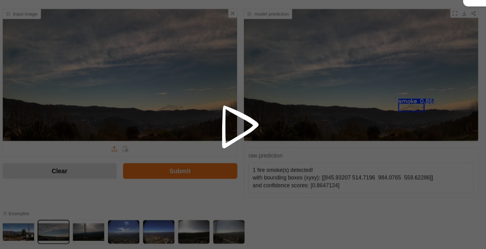

# Pyronear: Machine Learning Pipeline for Wildfire Detection 🔥

Machine Learning Training Pipeline for Wildfire Detection.

[](https://www.earthtoolsmaker.org/spaces/early_forest_fire_detection/)


## Data Pipeline

The whole repository is organized as a data pipeline that can be run to
train the models and export them to the appropriate formats.

The Data pipeline is organized with a [dvc.yaml](./dvc.yaml) file.

### DVC Stages

This section list and describes all the DVC stages that are defined in the
[dvc.yaml](./dvc.yaml) file:

- __build_model_input__: Generate model input for YOLO custom dataset training
using the provided raw dataset.
- __train_yolo_baseline_small__: Train a YOLO baseline model on a subset of the
full dataset.
- __train_yolo_baseline__: Train a YOLO baseline model on the full dataset.
- __train_yolo_best__: Train the best YOLO model on the full dataset.
- __build_manifest_yolo_best__: Build the manifest.yaml file to attach with the model.
- __export_yolo_best__: Export the best YOLO model to different formats (ONNX, NCNN).

## Setup

### 🐍 Python dependencies

Install `uv` with `pipx`:

```sh
pipx install uv
```

Create a virtualenv and install the dependencies with `uv`:

```sh
uv sync
```

Activate the `uv` virutalenv:

```sh
source .venv/bin/activate
```

### Git LFS

Make sure [`git-lfs`](https://git-lfs.com/) is installed on your system.

Run the following command to check:

```sh
git lfs install
```

If not installed, one can install it with the following:

#### Linux

```sh
sudo apt install git-lfs
git-lfs install
```

#### Mac

```sh
brew install git-lfs
git-lfs install
```

#### Windows

Download and run the latest [windows installer](https://github.com/git-lfs/git-lfs/releases).


### Data Dependencies

To get the data dependencies one can use DVC - To fully use this
repository you would need access to our DVC remote storage which is
currently reserved for Pyronear members. On request, you will be provided with
AWS credentials to access our remote storage.

Pull the data files needed for training the model:

```sh
dvc get . ./data/03_model_input/
```

Pull all the data files tracked by DVC using this command:

```sh
dvc pull
```


##### Setup S3 access

Create the following file `~/.aws/config`:

```toml
[profile pyronear]
region = eu-west-3
```

Add your credentials in the file `~/.aws/credentials` - replace `XXX`
with your access key id and your secret access key:

```toml
[pyronear]
aws_access_key_id = XXX
aws_secret_access_key = XXX
```

Make sure you use the AWS `pyronear` profile:

```bash
export AWS_PROFILE=pyronear
```

## Project structure and conventions

The project is organized following mostly the [cookie-cutter-datascience
guideline](https://drivendata.github.io/cookiecutter-data-science/#directory-structure).

### Data

All the data lives in the `data` folder and follows some [data engineering
conventions](https://docs.kedro.org/en/stable/faq/faq.html#what-is-data-engineering-convention).

### Library Code

The library code is available under the `pyronear_mlops` folder.

### Notebooks

The notebooks live in the `notebooks` folder. They are automatically synced to
the Git LFS storage.
Please follow [this
convention](https://drivendata.github.io/cookiecutter-data-science/#notebooks-are-for-exploration-and-communication)
to name your Notebooks.

`<step>-<ghuser>-<description>.ipynb` - e.g., `0.3-mateo-visualize-distributions.ipynb`.

### Scripts

The scripts live in the `scripts` folder, they are
commonly CLI interfaces to the library
code.

## DVC

DVC is used to track and define data pipelines and make them
reproducible. See `dvc.yaml`.

To get an overview of the pipeline DAG:

```sh
dvc dag
```

To run the full pipeline:

```sh
dvc repro
```

## MLFlow

An MLFlow server is running when running ML experiments to track
hyperparameters and performances and to streamline model
selection.

To start the mlflow UI server, run the following command:

```sh
make mlflow_start
```

To stop the mlflow UI server, run the following command:

```sh
make mlflow_stop
```

To browse the different runs, open your browser and navigate to the URL:
[http://localhost:5000](http://localhost:5000)

## Test Suite

Run the test suite with the following commmand:

```sh
make run_test_suite
```

## Contribute to the project

### New ML experiments

Follow the steps:

1. Work on a separate git branch: `git checkout -b "<user>/<experiment-name>"`
2. Modify and iterate on the code, then run `dvc repro`. It will rerun
   parts of the pipeline that have been updated.
3. Commit your changes and open a Pull Request to get your changes
   approved and merged.

### Run Random Hyperparameter Search

We use random hyperparameter search to find the best set of hyperparameters for
our models.

#### Wide & Fast

The initial stage is to optimize for exploration of all hyperparameter ranges.
A [wide.yaml](./scripts/model/yolo/spaces/wide.yaml) hyperparamter config file
is available for performing this type of search.

It is good practice to run this search on a small subset of the full dataset to
make quickly iterate over many different combinations of hyperparameters.

Run the wide and fast hyperparameter search with:

```sh
make run_yolo_wide_hyperparameter_search
```

#### Narrow & Deep


The second stage of the hyperparameter search is to run some more narrow and
local searches on identified combinations of good parameters from stage 1.
A [narrow.yaml](./scripts/model/yolo/spaces/narrow.yaml) hyperparameter config
file is available for this type of search.

It is good practice to run this search on the full dataset to get the actual
model performances of the randomly drawn sets of hyperparameters.

Run the narrow and deep hyperparameter search with:

```sh
make run_yolo_narrow_hyperparameter_search
```

#### Custom

Adapt and run this command to launch a specific hyperparamater space search:

```sh
uv run python ./scripts/model/yolo/hyperparameter_search.py \
   --data ./data/03_model_input/wildfire/full/datasets/data.yaml \
   --output-dir ./data/04_models/yolo/ \
   --experiment-name "random_hyperparameter_search" \
   --filepath-space-yaml ./scripts/model/yolo/spaces/default.yaml \
   --n 5 \
   --loglevel "info"
```

One can adapt the hyperparameter space to search by adding a new `space.yaml`
file based on the [default.yaml](./scripts/model/yolo/spaces/default.yaml)

```yaml
model_type:
  type: array
  array_type: str
  values:
    - yolo11n.pt
    - yolo11s.pt
    - yolo12n.pt
    - yolo12s.pt
epochs:
  type: space
  space_type: int
  space_config:
    type: linear
    start: 50
    stop: 70
    num: 10
patience:
  type: space
  space_type: int
  space_config:
    type: linear
    start: 10
    stop: 50
    num: 10
batch:
  type: array
  array_type: int
  values:
    - 16
    - 32
    - 64
...
```

### Generate a benchmark CSV file

```sh
make run_yolo_benchmark
```

## 🌎 Release a new Model to the world

The script to release a new version of the model is located in
`./scripts/model/yolo/release.py`.
Make sure to set your `GITHUB_ACCESS_TOKEN` as an env variable in your shell
before running the following script:

```sh
export GITHUB_ACCESS_TOKEN=XXX
uv run python ./scripts/release.py \
  --version v4.0.0 \
  --release-name "dazzling dragonfly" \
  --github-owner earthtoolsmaker \
  --github-repo pyro-train
```

This will create a new release in the github repository with the model
artifacts such as its weights.

__Note__: The current naming convention for release is to use an adjective
paired with an animal name starting with the same letter (eg. artistic alpaca,
wise wolf, ...).
