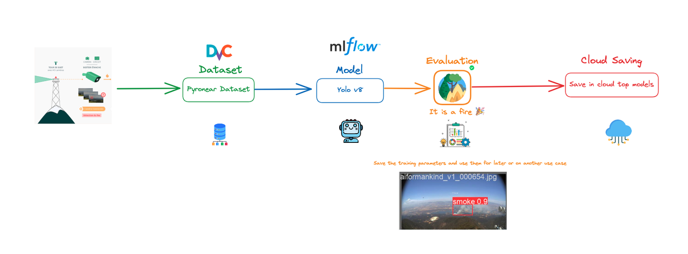
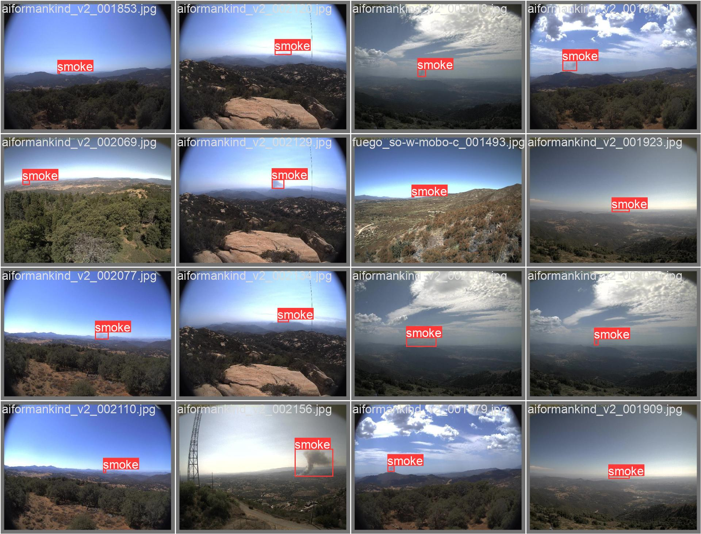

# Pyronear: Machine Learning Pipeline for Wildfire Detection 🔥


Machine Learning Pipeline for Wildfire Detection.



## Setup

### Dependencies

- [Poetry](https://python-poetry.org/): Python packaging and dependency
management - Install it with something like `pipx`
- [Git LFS](https://git-lfs.com/): Git Large File Storage replaces large
files such as jupyter notebooks with text pointers inside Git while
storing the file contents on a remote server like github.com
- [DVC](https://dvc.org/): Data Version Control  - This will get
installed automatically
- [MLFlow](https://mlflow.org/): ML Experiment Tracking - This will get
installed automatically

### Install

#### Poetry

Follow the [official documentation](https://python-poetry.org/docs/) to install `poetry`.

#### Git LFS

Make sure [`git-lfs`](https://git-lfs.com/) is installed on your system.

Run the following command to check:

```sh
git lfs install
```

If not installed, one can install it with the following:

##### Linux

```sh
sudo apt install git-lfs
git-lfs install
```

##### Mac

```sh
brew install git-lfs
git-lfs install
```

##### Windows

Download and run the latest [windows installer](https://github.com/git-lfs/git-lfs/releases).

#### Project Dependencies

Create a virtualenv and install python version with conda - or use a
combination of pyenv and venv:

```sh
conda create -n pyronear-mlops python=3.12
```

Activate the virtual environment:

```sh
conda activate pyronear-mlops
```

Install python dependencies

```sh
poetry install
```

#### Data Dependencies

To get the data dependencies one can use DVC - To fully use this
repository you would need access to our DVC remote storage which is
currently reserved for Pyronear members. On request, you will be provided with
AWS credentials to access our remote storage.

Once setup, run the following command:

```sh
dvc pull
```



##### Setup S3 access

Create the following file `~/.aws/config`:

```toml
[profile pyronear]
region = eu-west-3
```

Add your credentials in the file `~/.aws/credentials` - replace `XXX`
with your access key id and your secret access key:

```toml
[pyronear]
aws_access_key_id = XXX
aws_secret_access_key = XXX
```

Make sure you use the AWS `pyronear` profile:

```bash
export AWS_PROFILE=pyronear
```

## Project structure and conventions

The project is organized following mostly the [cookie-cutter-datascience
guideline](https://drivendata.github.io/cookiecutter-data-science/#directory-structure).

### Data

All the data lives in the `data` folder and follows some [data engineering
conventions](https://docs.kedro.org/en/stable/faq/faq.html#what-is-data-engineering-convention).

### Library Code

The library code is available under the `pyronear_mlops` folder.

### Notebooks

The notebooks live in the `notebooks` folder. They are automatically synced to
the Git LFS storage.
Please follow [this
convention](https://drivendata.github.io/cookiecutter-data-science/#notebooks-are-for-exploration-and-communication)
to name your Notebooks.

`<step>-<ghuser>-<description>.ipynb` - e.g., `0.3-mateo-visualize-distributions.ipynb`.

### Scripts

The scripts live in the `scripts` folder, they are
commonly CLI interfaces to the library
code.

## DVC

DVC is used to track and define data pipelines and make them
reproducible. See `dvc.yaml`.

To get an overview of the pipeline DAG:

```sh
dvc dag
```

To run the full pipeline:

```sh
dvc repro
```

## MLFlow

An MLFlow server is running when running ML experiments to track
hyperparameters and performances and to streamline model
selection.

To start the mlflow UI server, run the following command:

```sh
make mlflow_start
```

To stop the mlflow UI server, run the following command:

```sh
make mlflow_stop
```

To browse the different runs, open your browser and navigate to the URL:
[http://localhost:5000](http://localhost:5000)

## Contribute to the project

### New ML experiments

Follow the steps:

1. Work on a separate git branch: `git checkout -b "<user>/<experiment-name>"`
2. Modify and iterate on the code, then run `dvc repro`. It will rerun
   parts of the pipeline that have been updated.
3. Commit your changes and open a Pull Request to get your changes
   approved and merged.

### Run Random Hyperparameter Search

#### YOLOv8

Use the following commands to run random hyperparameter search:

```sh
make run_yolov8_hyperparameter_search
```

It will run 10 random training runs with hyperparameters drawn from the
hyperparameter space defined in
`pyronear_mlops/model/yolo/hyperparameters/yolov8.py`

#### YOLOv9

Use the following commands to run random hyperparameter search:

```sh
make run_yolov9_hyperparameter_search
```

It will run 10 random training runs with hyperparameters drawn from the
hyperparameter space defined in
`pyronear_mlops/model/yolo/hyperparameters/yolov9.py`

### Generate a benchmark CSV file

#### YOLOv8

```sh
make yolov8_benchmark
```

#### YOLOv9

```sh
make yolov9_benchmark
```
